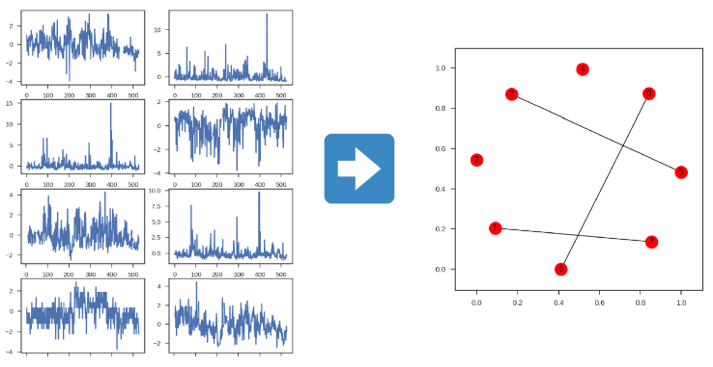
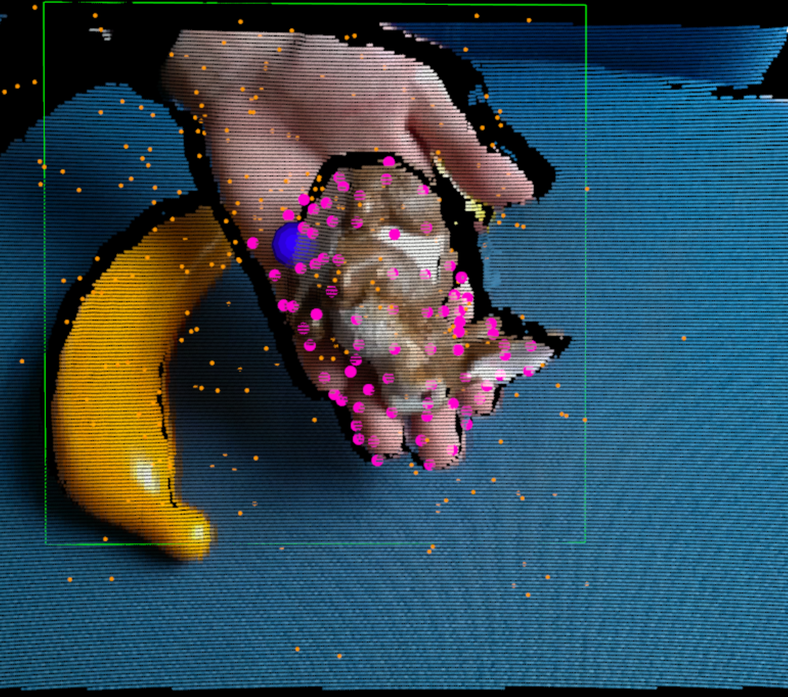
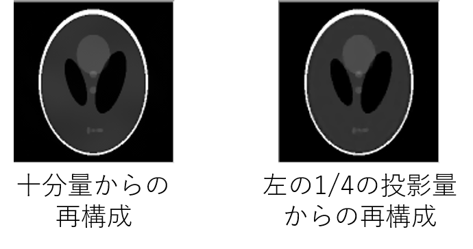
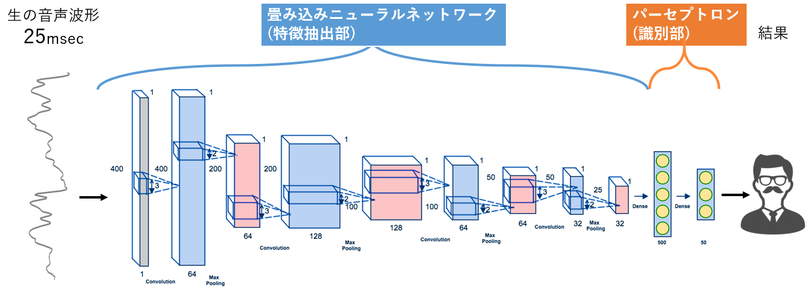
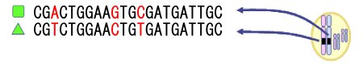
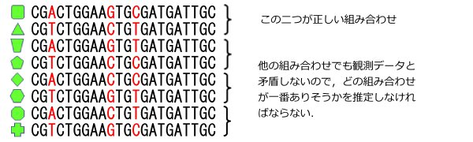
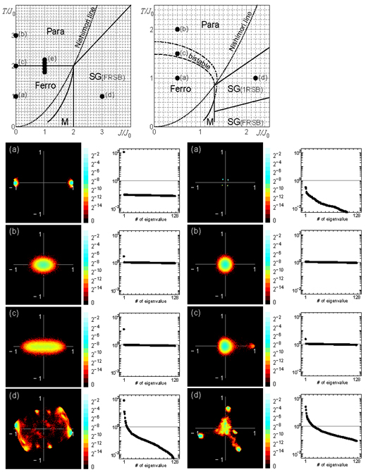
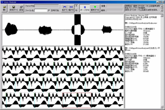

### グラフィカルモデルの構造推定

たとえば、工業機械に取り付けられた温度・湿度・圧力センサーなどの時間的に変化するデータから、センサー同士の関係性を推定する問題を、グラフィカルモデルの構造推定と呼びます。構造推定を行うことで、センサーデータから現在・将来の異常を検出する異常検知などの問題に役立てることができます。[(論文)](https://arxiv.org/abs/1807.00944)

### RGB-Dセンサーによるリアルタイムトラッキング

物体をリアルタイムにトラッキングすることはロボットや AR の発展において非常に重要です。しかし、物体は常に同じように見えているわけではなく、姿勢が変わったり変形したり一部が隠れたりします。
そこで、近年普及してきた RGB-D センサーから得られるデータを使用して、姿勢変化、変形、オクルージョンにロバストなリアルタイムトラッキング手法を開発しました。さらにその方法を用いて、逐次的に物体形状を学習して、段階的に強固になるトラッキング方法の開発を目指します。

---

### MRI画像の再構成

医療画像を再構成する手法である MRI には現在、撮像時間が長く患者の負担になるという問題点があります。この問題を解決するために、コイルを複数個用いたり、圧縮センシングという手法で、少ない観測データ数からきれいな画像を再構成し時間の短縮を図ります。このとき様々な事前知識を想定したり，それらを組み合わせたりすることでより良い画像の再構成を目指します。

---

### CT画像の再構成

X 線 CT 検査は被ばくを伴う放射線を使用しており、使用線量の低減が必要です。検査の円筒機器内において X 線を当てる方向の数を間引くことでこれを実現し、圧縮センシングと呼ばれる技術を用いて、十分量用いた時と同等の質の画像を得ることを目指します。
圧縮センシングとは、事前分布を用いて少数の観測から対象の事後分布やその MAP 解を求める手法です。本研究においては、 CT 画像の“本来画像として持つ性質”が事前分布に対応します。

---

### 話者認識

話者認識は予め人の声を登録しておき、発話した人が登録話者の中の誰か、また登録話者であるかないかを識別する人の声を使った生体認証システムの一種です。しかし現段階での話者認識システムは、他の生体認証システムと比べデータ入力時間（発話時間）が長く、識別制度も不十分であるという問題があります。
この問題を解決するために、短い音声波形から重要な特徴量を抽出する事、得られた特徴量を使って効率よく学習する方法の考案を目指しています。

---

### haplotype推定問題

　病期の予後，薬剤の効果・副作用はhaplotype依存なので，どの二つのhaplotypeを持っているかを推定できれば，一人ひとりに応じた診断や治療が可能になる筈です．しかし，通常の方法では個々のhaplotypeは直接測定できず，両親から貰ったhaplotypeが合体した形で測定されます．次の二つのhaplotypeを持っていてSNPが3(=N)箇所ある場合
 

観測されるのは

観測データから考えられる可能性は4(=2^(N-1))通り
作られる可能性のあるタンパク質の種類は8(=2^N)通り

→ 親戚や同じ人種のデータがあれば推定可能……
しかし，SNPが100箇所あったら2^100通りの可能性 → 計算しきれない
この計算を近似的に何とかやる方法を研究しています．

---
### 構造解析(モデル選択)問題

　推定されたhaplotypeと診療における特徴をどのように結び付けるか，という問題は，簡単な解き方もあるのですが，性能がいまひとつです． 複雑なデータは通常，階層構造などの構造を持っていますので，どのような構造が最適かを決めることができれば，大きな手掛かりとなります．なるべく汎用的な手法を開発する研究をしています．

---

### 相転移・スピングラス

　多くの素子が互いに影響を及ぼし合う高次元の世界では，３次元世界の私たちには想像できないような不思議な現象が起こります．相転移現象や，スピングラス状態などです．これは現実の物質に限定されたことではなく，抽象化された情報の世界でも同じで，物質的な制約を取っ払ったものを研究しています．
 高次元分布は直感的な理解が難しいため，平面に射影させた図．相互作用の仕方(左は2体相互作用，右は3体相互作用)というミクロのルールによって，大きく異なるマクロ状態が出現する．

---

### 誤り訂正符号・歪あり圧縮

　誤り訂正符号は，ノイズのある通信路で正しく通信を行う基盤技術です．性能を理論的な限界に近づける復号アルゴリズムの研究などを研究しています． 歪あり圧縮は誤り訂正符号の『裏返し』の問題で，解くのは更に難しいとされています．

---

### 一次視覚野情報からの画像推定

　視覚情報は脳の一次視覚野などで様々な処理をされています．ここでの神経活動を詳細に計測できれば，今，何を見ているかが逆に分かるかもしれません．更に，頭の中で想像しているものや，夢すらも画像として再現することが可能かもしれません．

---

### 嗄声評価法の開発

　情報処理の一側面は，混ざってしまったものを選り分けることです．１や５では欲しいデータ自体が混ざっていますが，多くの場合は，４のように信号とノイズが混ざっています．何れにせよ，これを分離できればめでたしです．しゃがれ声の診断も，声のきれいな成分とノイズ成分に分離できれば良いのです．

音の問題は，様々な情報が一次元時系列データに潰されている上，ヒトの聴覚が様々な特徴抽出をしているため，非常に 難しい問題です．
